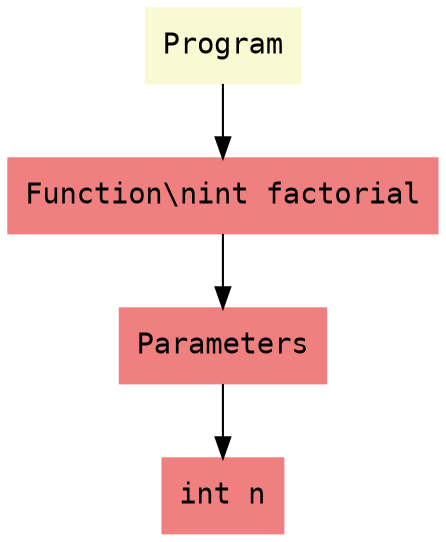

# PARSER README - Документация синтаксического анализатора

## ** О проекте**

Синтаксический анализатор (парсер) - второй компонент компилятора MiniLang, отвечающий за преобразование потока токенов от лексера в абстрактное синтаксическое дерево (AST). Парсер реализован методом рекурсивного спуска и полностью соответствует формальной грамматике языка.

---

## ** Быстрый старт**

### **Сборка проекта**
```bash
# Очистка и сборка
make clean
make

# Проверка, что парсер работает
./minicompiler parse examples/factorial.src
```

### **Базовое использование**
```bash
# Парсинг файла с выводом AST в текстовом формате
./minicompiler parse <filename>

# Сохранить AST в файл
./minicompiler parse examples/factorial.src --output ast.txt

# Сгенерировать DOT файл для визуализации
./minicompiler parse examples/factorial.src --format dot --output ast.dot

# Визуализировать DOT файл (требуется Graphviz)
dot -Tpng ast.dot -o ast.png
eog ast.png
```

---

## ** Команды программы**

| Команда | Описание | Пример |
|---------|----------|---------|
| `parse <file>` | Парсинг и построение AST | `./minicompiler parse factorial.src` |
| `parse <file> --format text` | Текстовый вывод AST (по умолчанию) | `./minicompiler parse factorial.src --format text` |
| `parse <file> --format dot` | Вывод в формате DOT | `./minicompiler parse factorial.src --format dot` |
| `parse <file> --format json` | Вывод в формате JSON | `./minicompiler parse factorial.src --format json` |
| `parse <file> --output <file>` | Сохранить результат в файл | `./minicompiler parse factorial.src --output ast.dot` |
| `parse <file> --verbose` | Подробный вывод (включая токены) | `./minicompiler parse factorial.src --verbose` |
| `parse <file> --stats` | Показать статистику | `./minicompiler parse factorial.src --stats` |
| `compile <file>` | Полная компиляция (препроцессор + лексер + парсер) | `./minicompiler compile program.src` |

---

## ** Формат вывода AST**

### **Текстовый формат**
```
Program [line 1]
  FunctionDecl: int factorial [line 1]
    Parameters:
      int n
    Block [line 1]
      IfStmt [line 2]
        Condition:
          BinaryOp: <= [line 2]
            Identifier: n [line 2]
            Literal: 1 [line 2]
        Then:
          Block [line 2]
            ReturnStmt [line 3]
              Literal: 1 [line 3]
      ReturnStmt [line 5]
        BinaryOp: * [line 5]
          Identifier: n [line 5]
          Call: factorial [line 5]
            Arguments:
              BinaryOp: - [line 5]
                Identifier: n [line 5]
                Literal: 1 [line 5]
```

### **DOT формат (для Graphviz)**


---

## ** Архитектура парсера**

### **Компоненты**

| Файл | Назначение |
|------|------------|
| `include/parser/Parser.hpp` | Интерфейс парсера |
| `src/parser/Parser.cpp` | Реализация парсера рекурсивного спуска |
| `include/parser/AST.hpp` | Иерархия узлов AST |
| `src/parser/AST.cpp` | Реализация методов AST |
| `include/parser/ASTVisitor.hpp` | Интерфейс Visitor для обхода AST |
| `include/parser/ASTPrettyPrinter.hpp` | Красивый вывод AST |
| `src/parser/ASTPrettyPrinter.cpp` | Реализация pretty printer |
| `include/parser/ASTDotGenerator.hpp` | Генератор DOT для визуализации |
| `src/parser/ASTDotGenerator.cpp` | Реализация DOT генератора |
| `src/parser/grammar.txt` | Формальная грамматика в текстовом формате |

### **Иерархия узлов AST**

```
ASTNode (абстрактный)
├── ExpressionNode
│   ├── LiteralExprNode
│   ├── IdentifierExprNode
│   ├── BinaryExprNode
│   ├── UnaryExprNode
│   ├── CallExprNode
│   ├── IndexExprNode
│   └── MemberAccessExprNode
├── StatementNode
│   ├── BlockStmtNode
│   ├── ExprStmtNode
│   ├── VarDeclStmtNode
│   ├── IfStmtNode
│   ├── WhileStmtNode
│   ├── ForStmtNode
│   └── ReturnStmtNode
└── DeclarationNode
    ├── FunctionDeclNode
    ├── StructDeclNode
    └── ProgramNode
```

---

## ** Грамматика языка**

### **Программа**
```
Program ::= { Declaration }
```

### **Объявления**
```
Declaration     ::= FunctionDecl | StructDecl
FunctionDecl    ::= 'fn' Identifier '(' [ Parameters ] ')' [ '->' Type ] Block
StructDecl      ::= 'struct' Identifier '{' { VarDecl } '}'
VarDecl         ::= Type Identifier [ '=' Expression ] ';'
Parameters      ::= Parameter { ',' Parameter }
Parameter       ::= Type Identifier
Type            ::= 'int' | 'float' | 'bool' | 'string' | Identifier
```

### **Инструкции**
```
Statement       ::= Block | IfStmt | WhileStmt | ForStmt | ReturnStmt | ExprStmt | VarDecl | EmptyStmt
Block           ::= '{' { Statement } '}'
IfStmt          ::= 'if' '(' Expression ')' Statement [ 'else' Statement ]
WhileStmt       ::= 'while' '(' Expression ')' Statement
ForStmt         ::= 'for' '(' [ ExprStmt ] ';' [ Expression ] ';' [ ExprStmt ] ')' Statement
ReturnStmt      ::= 'return' [ Expression ] ';'
ExprStmt        ::= Expression ';'
EmptyStmt       ::= ';'
```

### **Выражения с приоритетом**
```
Expression      ::= Assignment
Assignment      ::= LogicalOr [ ('=' | '+=' | '-=' | '*=' | '/=' | '%=') Assignment ]
LogicalOr       ::= LogicalAnd { '||' LogicalAnd }
LogicalAnd      ::= Equality { '&&' Equality }
Equality        ::= Relational { ('==' | '!=') Relational }
Relational      ::= Additive { ('<' | '<=' | '>' | '>=') Additive }
Additive        ::= Multiplicative { ('+' | '-') Multiplicative }
Multiplicative  ::= Unary { ('*' | '/' | '%') Unary }
Unary           ::= ('-' | '!' | '++' | '--') Unary | Postfix
Postfix         ::= Primary { PostfixOp }
PostfixOp       ::= '++' | '--' | CallSuffix | IndexSuffix | MemberAccess
CallSuffix      ::= '(' [ Arguments ] ')'
IndexSuffix     ::= '[' Expression ']'
MemberAccess    ::= '.' Identifier
Primary         ::= Literal | Identifier | '(' Expression ')' | Call
Call            ::= Identifier '(' [ Arguments ] ')'
Arguments       ::= Expression { ',' Expression }
```

---

## ** Приоритет и ассоциативность операторов**

| Уровень | Операторы | Ассоциативность |
|---------|-----------|-----------------|
| 1 | `()` `[]` `.` `()` (вызов) | Левая |
| 2 | `++` `--` (постфиксные) | Левая |
| 3 | `++` `--` `-` `!` (унарные) | Правая |
| 4 | `*` `/` `%` | Левая |
| 5 | `+` `-` | Левая |
| 6 | `<` `<=` `>` `>=` | Левая |
| 7 | `==` `!=` | Левая |
| 8 | `&&` | Левая |
| 9 | `\|\|` | Левая |
| 10 | `=` `+=` `-=` `*=` `/=` `%=` | Правая |

---

## ** Примеры использования**

### **Пример 1: Простая программа**
```bash
$ cat simple.src
fn main() -> int {
    return 42;
}

$ ./minicompiler parse simple.src
Program [line 1]
  FunctionDecl: int main [line 1]
    Block [line 1]
      ReturnStmt [line 2]
        Literal: 42 [line 2]
```

### **Пример 2: Арифметические выражения**
```bash
$ cat expr.src
fn test() {
    int a = 1 + 2 * 3;
    int b = (4 + 5) * 6;
    int c = -7;
}

$ ./minicompiler parse expr.src
Program [line 1]
  FunctionDecl: void test [line 1]
    Block [line 1]
      VarDecl: int a [line 2]
        Initializer:
          BinaryOp: + [line 2]
            Literal: 1 [line 2]
            BinaryOp: * [line 2]
              Literal: 2 [line 2]
              Literal: 3 [line 2]
      VarDecl: int b [line 3]
        Initializer:
          BinaryOp: * [line 3]
            BinaryOp: + [line 3]
              Literal: 4 [line 3]
              Literal: 5 [line 3]
            Literal: 6 [line 3]
      VarDecl: int c [line 4]
        Initializer:
          UnaryOp: - [line 4]
            Literal: 7 [line 4]
```

### **Пример 3: Условные операторы**
```bash
$ cat if.src
fn max(int a, int b) -> int {
    if (a > b) {
        return a;
    } else {
        return b;
    }
}

$ ./minicompiler parse if.src
Program [line 1]
  FunctionDecl: int max [line 1]
    Parameters:
      int a
      int b
    Block [line 1]
      IfStmt [line 2]
        Condition:
          BinaryOp: > [line 2]
            Identifier: a [line 2]
            Identifier: b [line 2]
        Then:
          Block [line 2]
            ReturnStmt [line 3]
              Identifier: a [line 3]
        Else:
          Block [line 4]
            ReturnStmt [line 5]
              Identifier: b [line 5]
```

### **Пример 4: Циклы**
```bash
$ cat while.src
fn sum(int n) -> int {
    int result = 0;
    int i = 1;
    while (i <= n) {
        result = result + i;
        i = i + 1;
    }
    return result;
}

$ ./minicompiler parse while.src
Program [line 1]
  FunctionDecl: int sum [line 1]
    Parameters:
      int n
    Block [line 1]
      VarDecl: int result [line 2]
        Initializer:
          Literal: 0 [line 2]
      VarDecl: int i [line 3]
        Initializer:
          Literal: 1 [line 3]
      WhileStmt [line 4]
        Condition:
          BinaryOp: <= [line 4]
            Identifier: i [line 4]
            Identifier: n [line 4]
        Body:
          Block [line 4]
            ExprStmt [line 5]
              BinaryOp: = [line 5]
                Identifier: result [line 5]
                BinaryOp: + [line 5]
                  Identifier: result [line 5]
                  Identifier: i [line 5]
            ExprStmt [line 6]
              BinaryOp: = [line 6]
                Identifier: i [line 6]
                BinaryOp: + [line 6]
                  Identifier: i [line 6]
                  Literal: 1 [line 6]
      ReturnStmt [line 8]
        Identifier: result [line 8]
```

### **Пример 5: Вызовы функций**
```bash
$ cat calls.src
fn add(int a, int b) -> int {
    return a + b;
}

fn mul(int a, int b) -> int {
    return a * b;
}

fn complex() -> int {
    int x = add(5, 3);
    int y = mul(x, 2);
    int z = add(mul(2, 3), add(4, 5));
    return z;
}

$ ./minicompiler parse calls.src
Program [line 1]
  FunctionDecl: int add [line 1]
    Parameters:
      int a
      int b
    Block [line 1]
      ReturnStmt [line 2]
        BinaryOp: + [line 2]
          Identifier: a [line 2]
          Identifier: b [line 2]
  FunctionDecl: int mul [line 4]
    Parameters:
      int a
      int b
    Block [line 4]
      ReturnStmt [line 5]
        BinaryOp: * [line 5]
          Identifier: a [line 5]
          Identifier: b [line 5]
  FunctionDecl: int complex [line 7]
    Block [line 7]
      VarDecl: int x [line 8]
        Initializer:
          Call: add [line 8]
            Arguments:
              Literal: 5 [line 8]
              Literal: 3 [line 8]
      VarDecl: int y [line 9]
        Initializer:
          Call: mul [line 9]
            Arguments:
              Identifier: x [line 9]
              Literal: 2 [line 9]
      VarDecl: int z [line 10]
        Initializer:
          Call: add [line 10]
            Arguments:
              Call: mul [line 10]
                Arguments:
                  Literal: 2 [line 10]
                  Literal: 3 [line 10]
              Call: add [line 10]
                Arguments:
                  Literal: 4 [line 10]
                  Literal: 5 [line 10]
      ReturnStmt [line 11]
        Identifier: z [line 11]
```

### **Пример 6: Массивы**
```bash
$ cat arrays.src
fn sumArray(int arr[], int size) -> int {
    int sum = 0;
    for (int i = 0; i < size; i = i + 1) {
        sum = sum + arr[i];
    }
    return sum;
}

fn main() -> int {
    int arr[10];
    arr[0] = 1;
    arr[1] = 2;
    arr[2] = 3;
    return sumArray(arr, 3);
}
```

### **Пример 7: Структуры и доступ к полям**
```bash
$ cat structs.src
struct Point {
    int x;
    int y;
}

struct Rectangle {
    Point topLeft;
    Point bottomRight;
}

fn main() -> int {
    Point p;
    p.x = 10;
    p.y = 20;
    
    Rectangle r;
    r.topLeft = p;
    r.bottomRight.x = 100;
    r.bottomRight.y = 200;
    
    return p.x + p.y;
}

$ ./minicompiler parse structs.src
Program [line 1]
  StructDecl: Point [line 1]
    Fields:
      VarDecl: int x [line 2]
      VarDecl: int y [line 3]
  StructDecl: Rectangle [line 6]
    Fields:
      VarDecl: struct Point topLeft [line 7]
      VarDecl: struct Point bottomRight [line 8]
  FunctionDecl: void main [line 11]
    Block [line 11]
      VarDecl: struct Point p [line 12]
      ExprStmt [line 13]
        BinaryOp: = [line 13]
          MemberAccess: .x [line 13]
            Identifier: p [line 13]
          Literal: 10 [line 13]
      ExprStmt [line 14]
        BinaryOp: = [line 14]
          MemberAccess: .y [line 14]
            Identifier: p [line 14]
          Literal: 20 [line 14]
      VarDecl: struct Rectangle r [line 16]
      ExprStmt [line 17]
        BinaryOp: = [line 17]
          MemberAccess: .topLeft [line 17]
            Identifier: r [line 17]
          Identifier: p [line 17]
      ExprStmt [line 18]
        BinaryOp: = [line 18]
          MemberAccess: .bottomRight.x [line 18]
            MemberAccess: .bottomRight [line 18]
              Identifier: r [line 18]
          Literal: 100 [line 18]
      ExprStmt [line 19]
        BinaryOp: = [line 19]
          MemberAccess: .bottomRight.y [line 19]
            MemberAccess: .bottomRight [line 19]
              Identifier: r [line 19]
          Literal: 200 [line 19]
      ReturnStmt [line 21]
        BinaryOp: + [line 21]
          MemberAccess: .x [line 21]
            Identifier: p [line 21]
          MemberAccess: .y [line 21]
            Identifier: p [line 21]
```

---

## ** Тестирование**

### **Запуск тестов парсера**
```bash
# Запустить все тесты парсера
make test-parser

# Запустить тесты интеграции
make test-integration

# Запустить все тесты (лексер + парсер)
make test-all
```

### **Структура тестов**
```
tests/parser/
├── valid/
│   ├── expressions/
│   │   ├── arithmetic.src
│   │   ├── arithmetic.expected
│   │   ├── comparison.src
│   │   ├── comparison.expected
│   │   ├── logical.src
│   │   └── logical.expected
│   ├── statements/
│   │   ├── if.src
│   │   ├── if.expected
│   │   ├── while.src
│   │   ├── while.expected
│   │   ├── for.src
│   │   └── for.expected
│   ├── declarations/
│   │   ├── functions.src
│   │   ├── functions.expected
│   │   ├── structs.src
│   │   └── structs.expected
│   └── full_programs/
│       ├── factorial.src
│       ├── factorial.expected
│       └── fibonacci.src
├── invalid/
│   └── syntax_errors/
│       ├── missing_semicolon.src
│       ├── missing_paren.src
│       ├── unclosed_brace.src
│       ├── unexpected_token.src
│       └── invalid_expression.src
└── parser_test_runner.cpp
```

---

## **Обработка ошибок**

### **Синтаксические ошибки**
```bash
$ cat error.src
fn test() {
    int x = 5
    return x;
}

$ ./minicompiler parse error.src
[ERROR] error.src:3:5: SYN-001: Expected ';' after variable declaration (found 'return')
[CONTEXT]     return x;
[POINTER]     ^
```

### **Незакрытые блоки**
```bash
$ cat unclosed.src
fn test() {
    int x = 5;
    if (x > 0) {
        return x;
    // missing closing brace

$ ./minicompiler parse unclosed.src
[ERROR] unclosed.src:4:5: SYN-006: Unclosed block starting here
[CONTEXT]     if (x > 0) {
[POINTER]     ^
[ERROR] unclosed.src:0:0: SYN-006: Expected '}' after block
```

### **Восстановление после ошибок**
```bash
$ cat multiple_errors.src
fn test() {
    int x = 5
    int y = ;
    return x
}

$ ./minicompiler parse multiple_errors.src
[ERROR] multiple_errors.src:3:5: SYN-001: Expected ';' after variable declaration (found 'int')
[ERROR] multiple_errors.src:4:5: SYN-001: Expected expression (found ';')
[ERROR] multiple_errors.src:5:5: SYN-001: Expected ';' after expression (found '}')
```

---

## ** Производительность**

| Параметр | Значение |
|----------|----------|
| Временная сложность | O(n) |
| Поддержка файлов | до 1 МБ |
| Глубина рекурсии | до 1000 (защита от переполнения стека) |
| Скорость парсинга | ~50 КБ/сек |

---

## ** Отладка**

### **Режим verbose**
```bash
# Показать токены и процесс парсинга
./minicompiler parse examples/factorial.src --verbose
```

### **Статистика**
```bash
# Показать статистику компиляции
./minicompiler parse examples/factorial.src --stats

Compilation Statistics:
- Total errors: 0
- Recovery attempts: 0
- Parse time: 0.015s
- AST nodes: 42
```

### **Визуализация AST**
```bash
# Сгенерировать DOT файл
./minicompiler parse examples/factorial.src --format dot --output factorial.dot

# Визуализировать
dot -Tpng factorial.dot -o factorial.png
eog factorial.png
```

---


